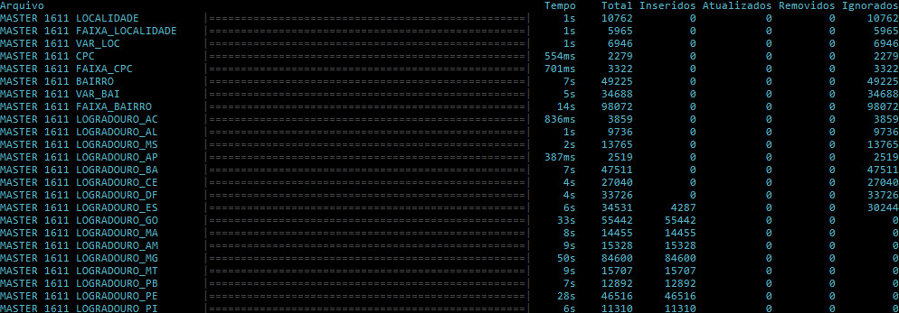

# Importação do e-DNE dos Correios

Programa console em .NET Core para ler os arquivos da base e-DNE dos Correios e
importá-los em banco de dados com integridade referencial.

O objetivo é permitir a fácil atualização da base ao somente adicionar os arquivos
delta à medida que eles são liberados. Quando um arquivo master for adicionado o
banco é reiniciado.

## Modo de uso

Obtenha o programa:

    git clone https://github.com/vmassuchetto/CorreiosDneImport

Coloque os arquivos do e-DNE sem alterar os nomes originais na pasta `Data`:

    eDNE_Delta_Master_1611.zip
    eDNE_Delta_Master_1612.zip
    eDNE_Delta_Master_1701.zip
    eDNE_Delta_Master_1702.zip
    eDNE_Delta_Master_1703.zip
    eDNE_Delta_Master_1704.zip
    eDNE_Master_1611.zip

Execute o programa informando a conexão com o banco de dados:

    dotnet run "Server=Servidor;Database=Banco;User Id=Usuario;Password=Senha;"

## Funcionamento

A importação é incremental usando arquivos `Master` -- completos e liberados
anualmente, e `Delta` -- parciais e liberados mensalmente. Arquivos `Delta`
possuem um indicador de operação para cada registro (`INS`, `UPD` e `DEL`).

Arquivos importados são registrados em uma tabela de controle para que não
serem lidos novamente. Descompactação do ZIP é feita em um diretório temporário
do sistema que é apagado após a importação.

Independente da quantidade de arquivos na pasta `Data`, o programa irá
construir a ordem correta a partir da última importação `Master` presente ou
que já foi importada anteriormente.

Arquivos que não estejam em sequência não serão importados. Registros já
importados são ignorados.

As tabelas são [mapeadas](https://github.com/vmassuchetto/CorreiosDneImport/blob/master/CorreiosDneImport/DneImport.cs#L44-L62)
da seguinte forma:

    LOG_LOGRADOURO -> CorreiosLogradouro
    LOG_LOCALIDADE -> CorreiosLocalidade
    LOG_FAIXA_CPC  -> CorreiosFaixaCpc

Os campos são convertidos para CamelCase:

    LOC_NU         -> LocNu
    UFE_SG         -> UfeSg
    LOG_NO_ABREV   -> LogNoAbrev_

Execução:

## Precauções

A integridade de dados é desligada durante o processo de importação. Execute a
importação em ambiente de testes para ter certeza que a sequência de deltas
liberada pelos Correios não invalida a integridade referencial. Estes casos
podem acontecer e lançam esta exceção ao final da importação:

    Unhandled Exception: System.Data.SqlClient.SqlException:
        The ALTER TABLE statement conflicted with the FOREIGN KEY constraint "FK_CorreiosVarLoc_CorreiosLocalidade".
        [...], table "dbo.CorreiosLocalidade", column 'LocNu'

No caso acima, algum valor do campo `LocNu` em `CorreiosVarLoc` não
consta em `CorreiosLocalidade`. Para encontrar este valor:

    SELECT vl.LocNu, l.LocNu
    FROM CorreiosVarLoc vl
    LEFT JOIN CorreiosLocalidade l ON l.LocNu = vl.LocNu
    WHERE l.LocNu IS NULL

Resultado:

    LocNu	LocNu
    7261	NULL
    7261	NULL
    7261	NULL
    7261	NULL
    7261	NULL
    7261	NULL

Para corrigir:

    DELETE FROM CorreiosVarLoc WHERE LocNu = 7261
